De website Vacit is een site waarop sollicitanten kunnen zoeken naar interessante vacatures en waarop bedrijven interessante kandidaten voor de door hen geplaatste vacatures kunnen vinden.

In de eerste week van het project heb ik ERD's en ASD's gemaakt om de data structuur inzichtelijk te krijgen. Daarnaast heb ik met php de functies gemaakt en getest die met de database communiceren in de backend kant. Tijdens de tweede week heb ik de meeste functionaliteiten van de website gekoppeld aan de backend kant. In de laatste week heb ik de website verder verfraaid en de inlog- en uploadfunctionaliteiten verbeterd. Hierbij is gebruik gemaakt van diverse tools, zoals vegas voor javascript, die een dynamische slideshow mogelijk maakt.

## Structuur

---

De site heeft diverse pagina's, te weten:

* Homepage
* Detailpagina
* Profielpagina (Voor sollicitant en werkgever)
* Mijn Sollicitaties (Alleen voor sollicitant)
* Mijn Vacatures (Alleen voor werkgever)
* Mijn Vacatures_Sollicitaties (Alleen voor werkgever)
* Inloggen
* Registreren
* Vacatures Toevoegen (Alleen voor werkgever)

---
---

## Technologieën

---

* MySQL Database
* PHP
* HTML
* CSS
* Foundation
* FontAwesome
* JQuery
* JavaScript
* Vegas
* Datatables.net
* Symfony
* Design pattern Model View Controller

Met behulp van het Symfony framework in PHP is de communicatie van de backend code met de achterliggende database veel gemakkelijker geworden. Tevens is het design pattern Model View Controller geïmplementeerd, waardoor de code is onderverdeeld in controllers, services, repositories en entities. Ook is er een command klasse gemaakt waardoor werkgevers hun informatie vanuit een spreadsheet kunnen importeren. Met Datatables.net worden de tabellen mooer aangekleed.

## Methoden en Technieken

Het ERD, met alle PK's en FK's, van deze case ziet er als volgt uit:

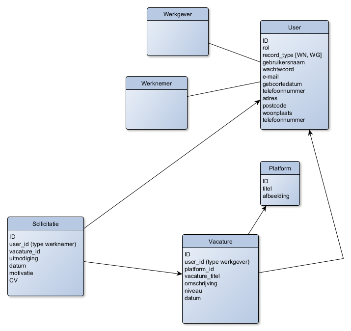

De ASD's zijn als volgt ingedeeld:

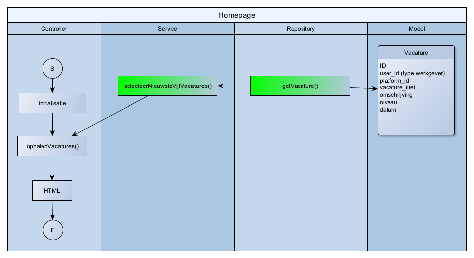
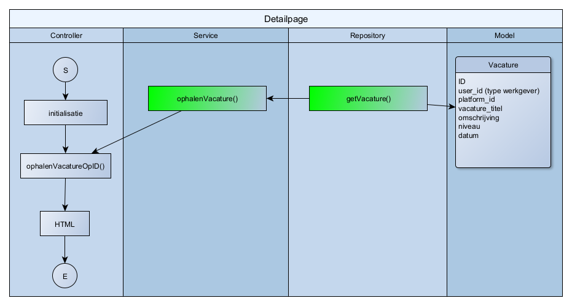
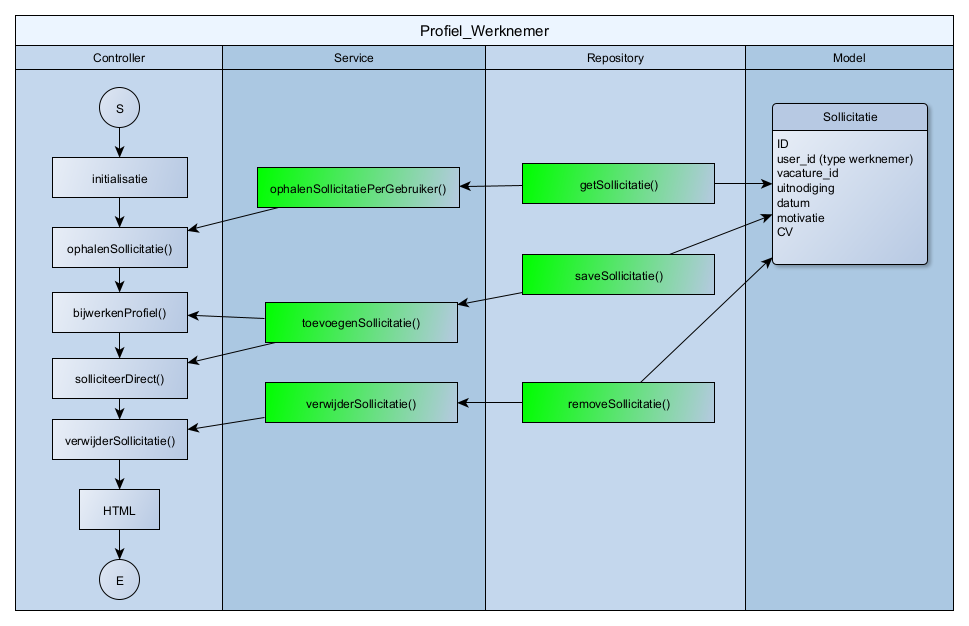
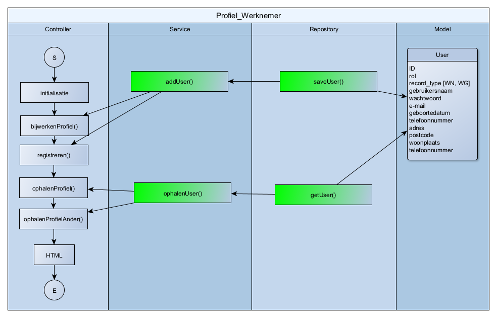
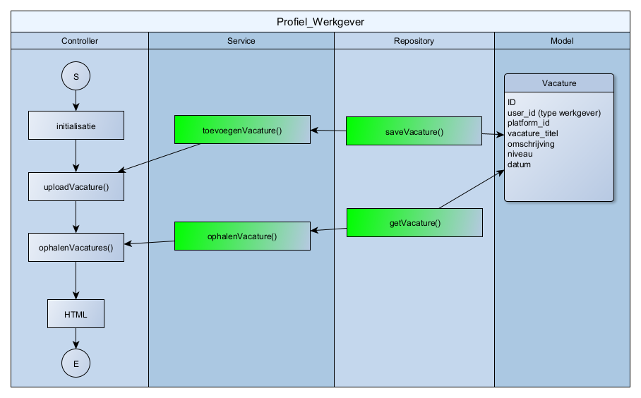
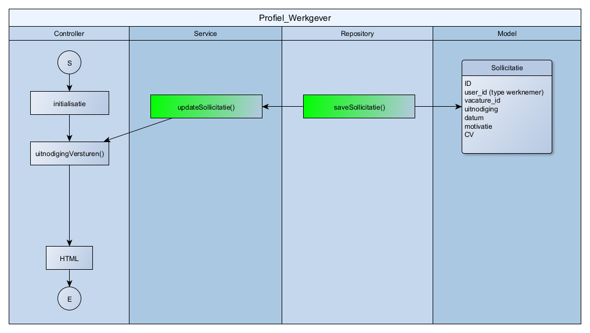
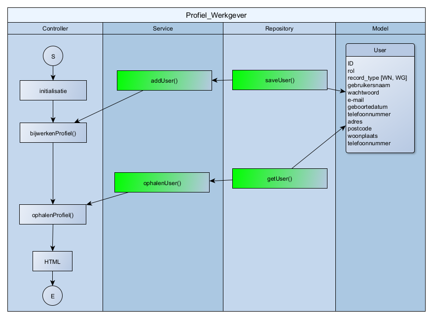

---

## Homepage

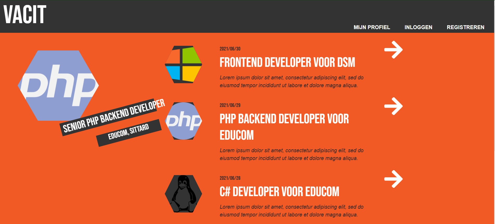

Op de homepage staan de nieuwste 5 vacatures die geupload zijn naar de site, samen met wat informatie. Een klik op de pijl brengt je naar de detailpagina. In de balk bovenin heeft men de keuze om in te loggen of zich te registreren als die persoon nog geen account heeft. De link naar het profiel verschijnt alleen als de gebruiker ingelogd is. Links is een dynamische slideshow aan de gang die een voor een door de vacatures loopt.

---

## Detailpagina

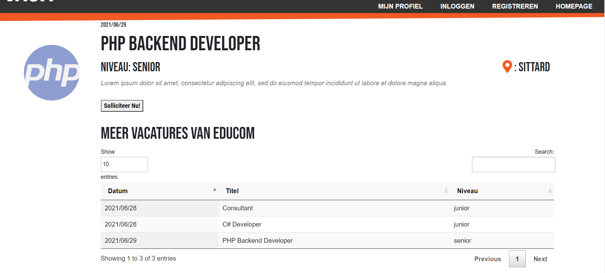

Op de detailpagina staat meer informatie over de vacature en heeft de sollicitant de mogelijkheid om te solliciteren op deze specifieke vacature. Door middel van een ajax call wordt de sollicitatie opgenomen in de database. Onderaan staat een tabel met alle vacatures van het betreffende bedrijf.

---

## Inlogpagina

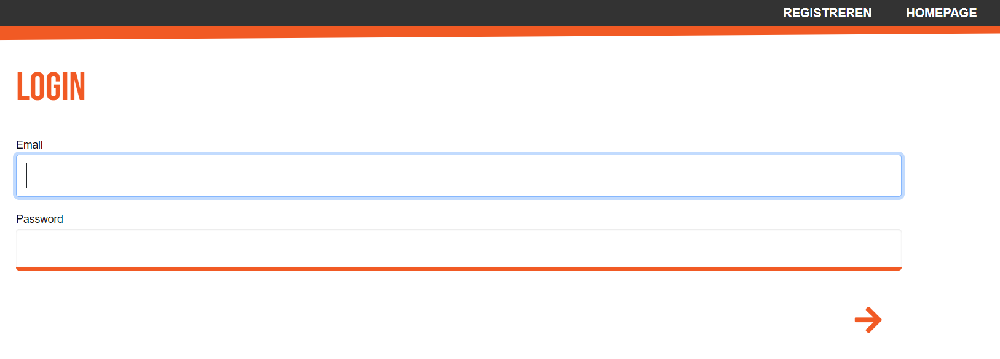

De gebruiker moet inloggen als hij of zij de eigen gegevens wil inzien. Alleen de Homepage en de detailpagina zijn publiek toegankelijk. Men kan alleen inloggen als het al een geregistreerde gebruiker is in de database. Zo niet, dan moet men zich eerst registreren door bovenin de balk op REGISTREREN te klikken.

---

## Registreren

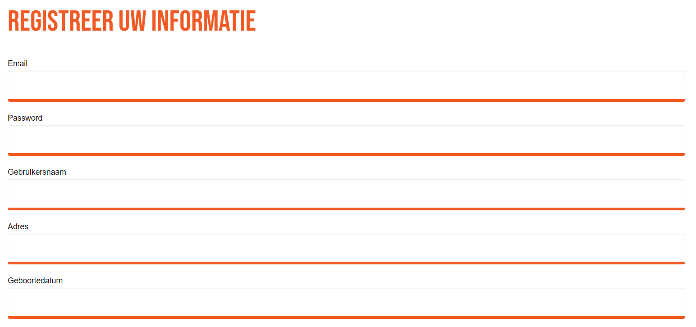

Hier kan een nieuwe gebruiker zijn of haar gegevens invoeren en vervolgens opslaan, waarna de gegevens worden doorgestuurd naar een database en de gebruiker wordt doorgestuurd naar . Het wachtwoord dat men invoert wordt automatisch gehasht en gecodeerd voor veiligheidsredenen.

## Profiel Sollicitant/Werkgever

Profiel Sollicitant:

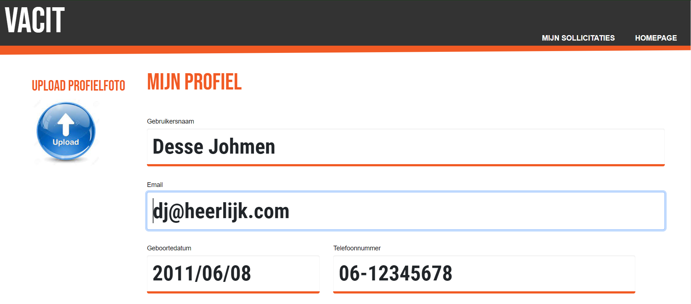
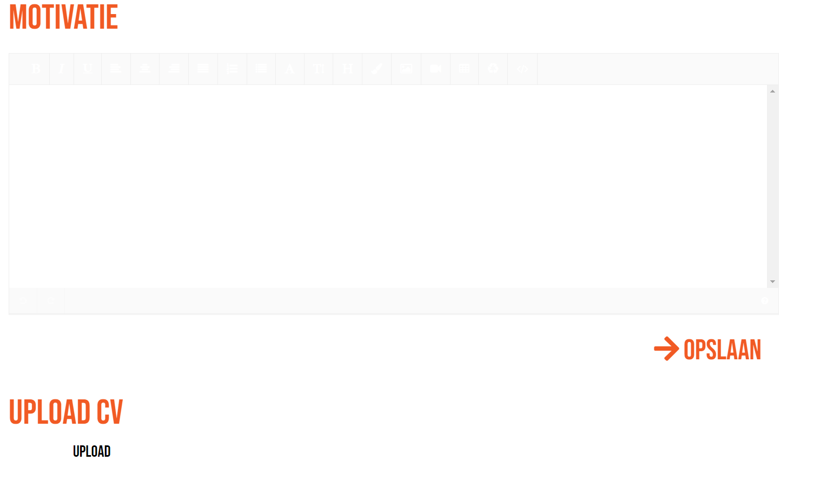

Profiel Werkgever:

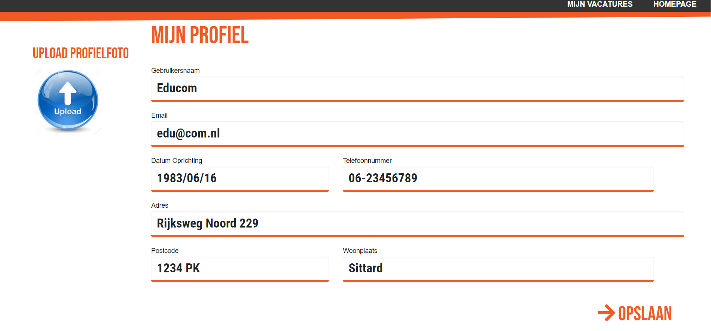

Op de profielpagina kan een sollicitant of werkgever zijn of haar gegevens bijwerken en een foto uploaden. Voor de sollicitant is er ook de mogelijkheid een motivatie middels een WYSIWYG-editor te maken. Daarnaast kan er een CV worden geupload. Het resultaat wordt vervolgens opgeslagen in de database wanneer men op opslaan klikt.
Bovenin de balk heeft de sollicitant de mogelijkheid naar al zijn of haar sollicitaties te kijken. De werkgever kan de vacatures bekijken waar bepaalde sollicitanten al dan niet op gesolliciteerd hebben.

---

## Mijn Vacatures

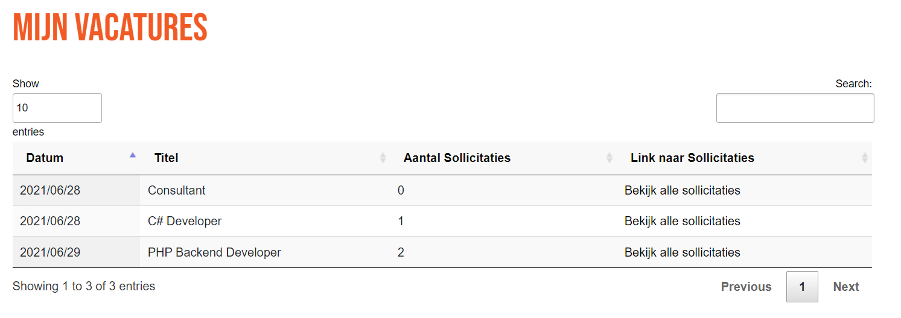

Op deze pagina zijn alle vacatures van de desbetreffende werkgever te vinden, samen met het aantal sollicitaties per vacature en een link naar alle sollicitaties voor die specifieke vacature.

---

## Mijn Sollicitaties op Vacatures

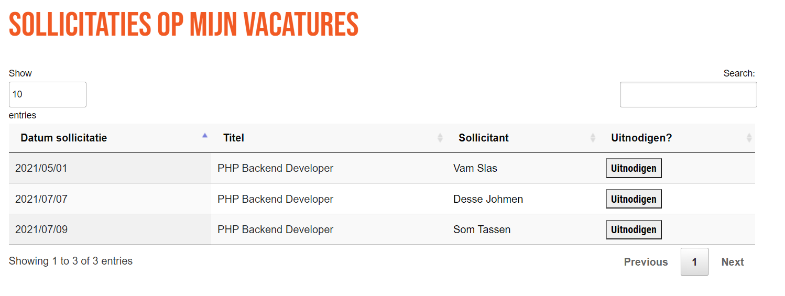

Hier zijn alle sollicitaties op een bepaalde vacature te zien. Er is een link naar de profielpagina voor elke sollicitant, zodat het bedrijf een oordeel kan vellen over de sollicitant. Wanneer dit oordeel positief is, kan het bedrijf de sollicitant uitnodigen voor een gesprek door op de knop uitnodigen te drukken.

---

## Mijn Sollicitaties

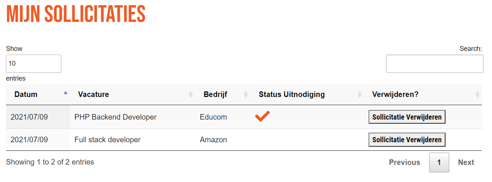

De sollicitant kan op deze pagina bekijken wat de status is van de sollicitatie die hij of zij gedaan heeft op een bepaalde vacature. Een vinkje betekent dat de werkgever een uitnodiging heeft verstuurd en dus geïnteresseerd is. Daarnaast zou de sollicitant de reeds verstuurde sollicitaties ongedaan kunnen maken als hij of zij niet meer geïnteresseerd zou zijn in de desbetreffende vacature.

